# Notes for NJU static analysis

## Lecture 1 Introduction

Static analysis analyzes a program P to reason about its behaviors and
determines whether it satisfies some properties before running P.

**Rice's Theorem:**
Any non-trivial property of the behavior of programs in a r.e. language is undecidable

> r.e. (recursively enumerable) = recognizable by a Turing-machine

A property is trivial if either it is not satisfied by any r.e. language,
or if it is satisfied by all r.e. languages; otherwise it is non-trivial.

> non-trivial properties ~= interesting properties ~= the properties related with run-time behaviors of programs

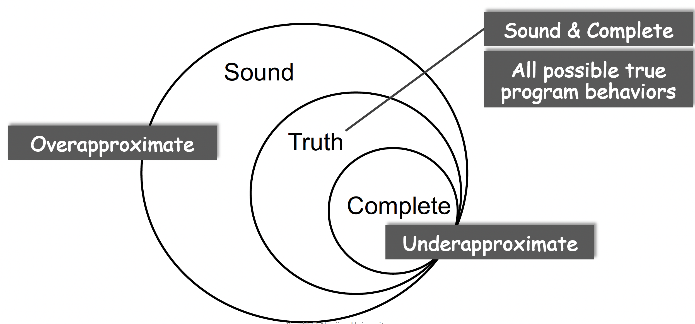

- An algorithm is sound if, anytime it returns an answer, the answer is true;
- An algorithm is complete if it guarantees to return all true answers.
- Compromise soundness (false negatives)
- Compromise completeness (false positives)

> Two Words to Conclude Static Analysis: Abstraction + Over-approximation

In static analysis, transfer functions define how to evaluate
different program statements on abstract values.

## Lecture 2 IR(IntermediateRepresentation)

AST(Abstract syntax tree)

- high-level and closed to grammar structure
- usually language dependent
- suitable for fast type checking
- lack of control flow information

IR(Intermediate Representation)

- low-level and closed to machine code
- usually language independent
- compact and uniform
- contains control flow information
- usually considered as the basis for static analysis

3 Address Code(3AC), each address can be one of the three things:

- name: a, b, c
- constant: 3
- compiler-generated temporary: t1

some common 3AC forms

- `x = y bop z` (bop -> binary operation)
- `x = uop y` (uop -> unary operation)
- `x = y`
- `goto L`
- `if x goto L`
- `if x rop y goto L` (rop -> relational operation)

Control Flow Analysis

- Usually refer to building Control Flow Graph (CFG)
- CFG serves as the basic structure for static analysis
- The node in CFG can be an individual 3-address instruction, or (usually) a Basic Block (BB)

Basic blocks (BB) are maximal sequences of consecutive
three-address instructions with the properties that

- It can be entered only at the beginning, i.e., the first
instruction in the block
- It can be exited only at the end, i.e., the last instruction
in the block

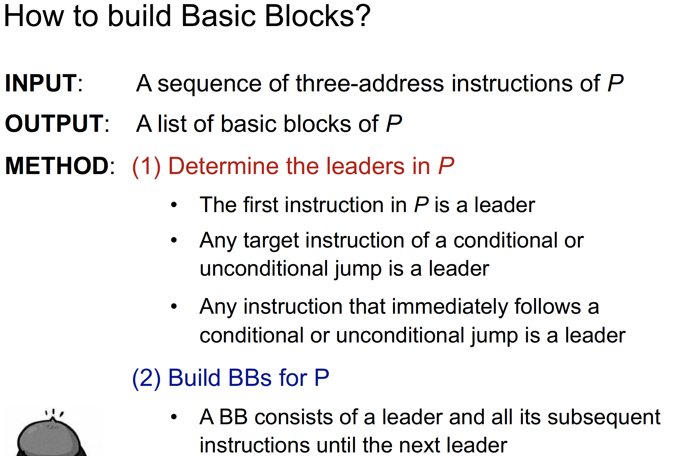

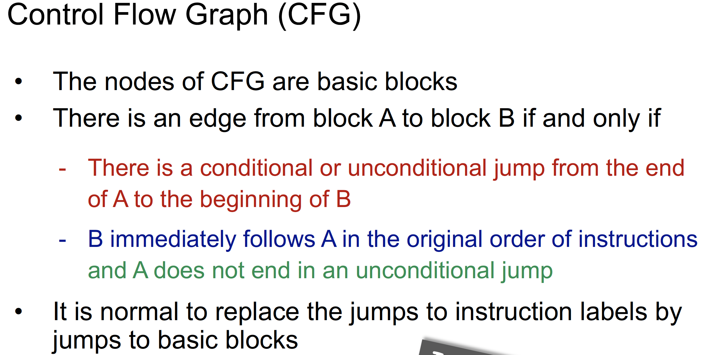

## Lecture 3 - 4 (Dataflow Analysis Application)

Input and Output States

- Each execution of an IR statement transforms an input state to a new output state
- The input (output) state is associated with the program point before (after) the statement

Data-flow analysis is to find a solution to a set of safe-approximation directed constraints on the IN[s]’s and OUT[s]’s, for all statements s.

- constraints based on semantics of statements (transfer functions)
- constraints based on the flows of control

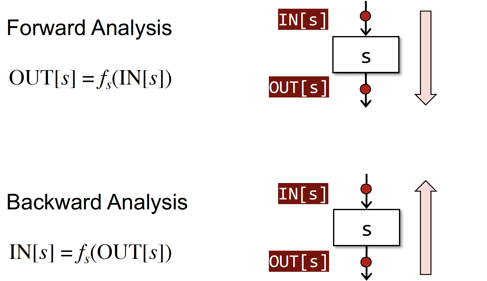

Notations for control flow's constraints
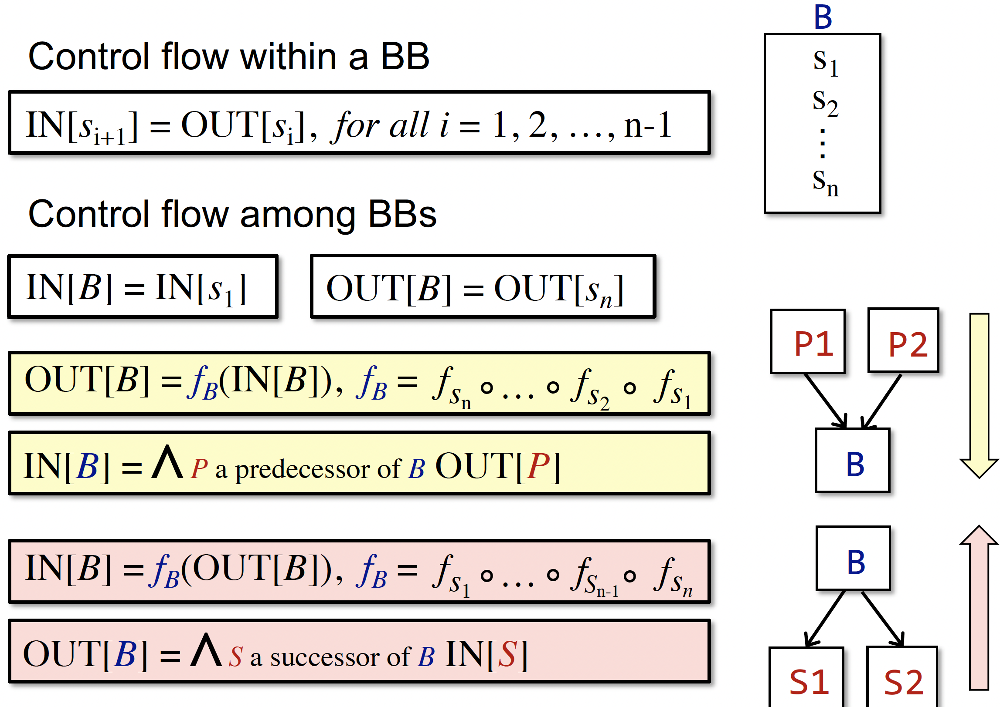

### Reaching Definitions

A definition d at program point `p` reaches a point `q` if there is a path from `p` to `q` such that d is not “killed” along that path

- A definition of a variable `v` is a statement that assigns a value to `v`
- Translated as: definition of variable `v` at program point p reaches point `q` if there is a path from `p` to `q` such that no new definition of `v` appears on that path
- Reaching definitions can be used to detect possible undefined
variables. e.g., introduce a dummy definition for each variable `v` at the entry of CFG, and if the dummy definition of `v` reaches a point `p` where `v` is used, then `v` may be used before definition (as undefined reaches `v`)

$$ D: v = x \, op \,y$$
This statement “generates” a definition `D` of variable `v` and “kills” all the other definitions in the program that define variable `v`, while leaving the remaining incoming definitions unaffected

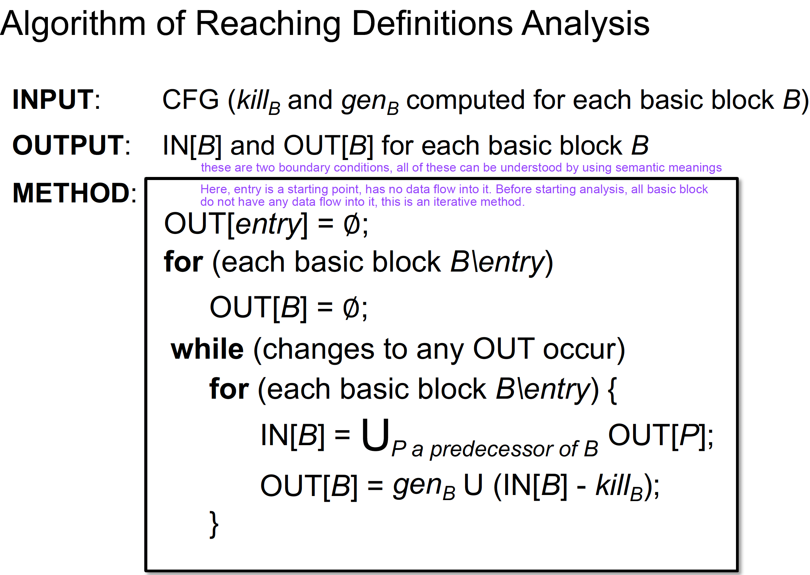
When more facts flow in IN[S], the “more facts” either is killed, or flows to OUT[S] (survivorS). When a fact is added to OUT[S], through either genS, or survivorS , it stays there forever. Thus OUT[S] never shrinks (e.g., 0à1, or 1à1). As the set of facts is finite (e.g., all definitions in the program), there must exist a pass of iteration during which nothing is added to any OUT, and then the algorithm terminates

### Live Variables Analysis

Live variables analysis tells whether the value of variable v at program point p could be used along some path in CFG starting at p. If so, v is live at p; otherwise, v is dead at p. Information of live variables can be used for register allocations. e.g., at some point all registers are full and we need to use one, then we should favor using a register with a dead value.

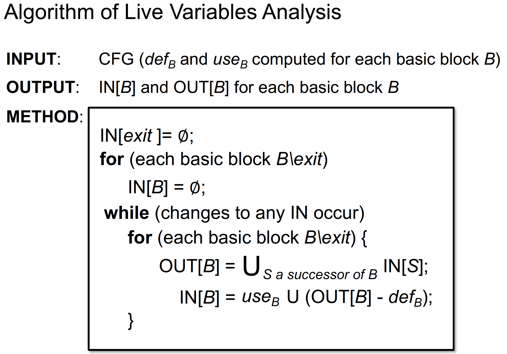

### Available Expressions Analysis

An expression x op y is available at program point p if (1) all paths from the entry to p must pass through the evaluation of x op y, and (2) after the last evaluation of x op y, there is no redefinition of x or y

- This definition means at program p, we can replace expression
x op y by the result of its last evaluation
- The information of available expressions can be used for
detecting global common subexpressions.

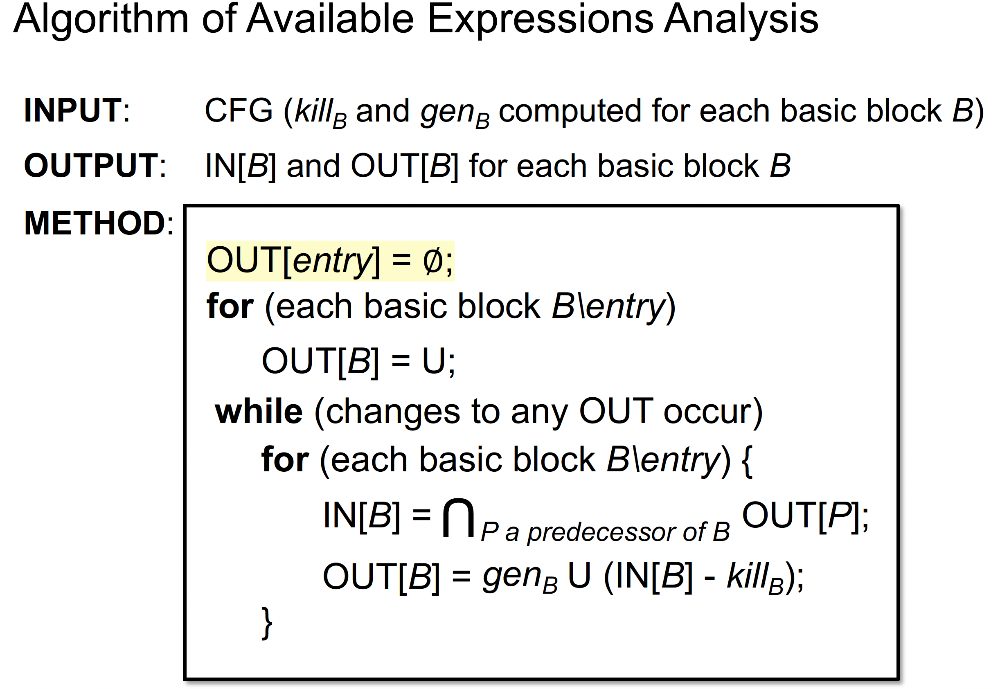

### Analysis Comparison

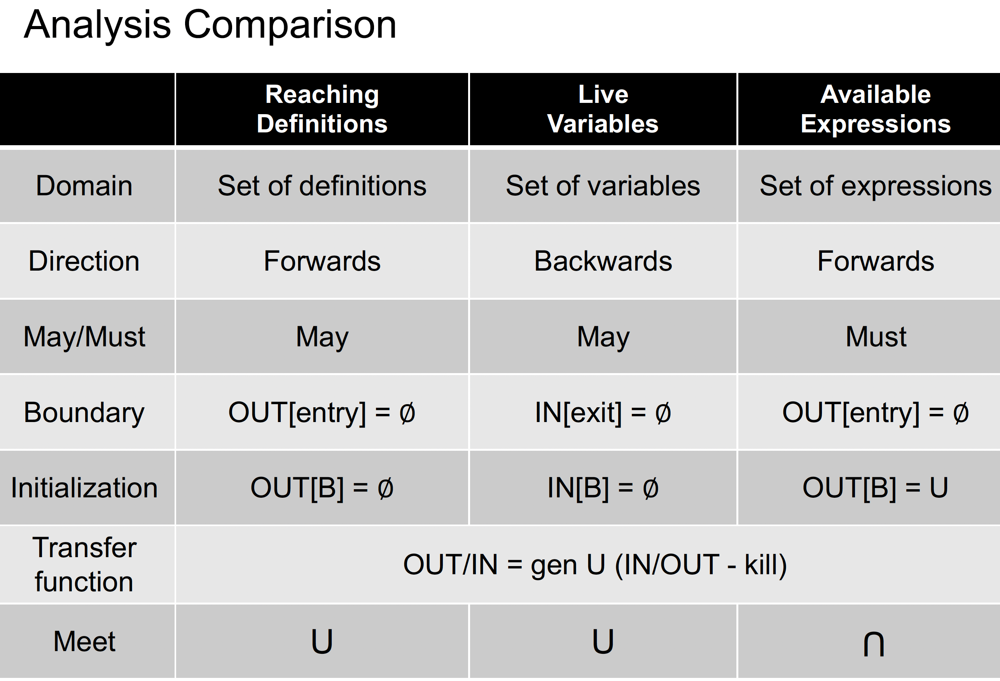

## Lecture 5 - 6 (Dataflow Analysis Foundation)

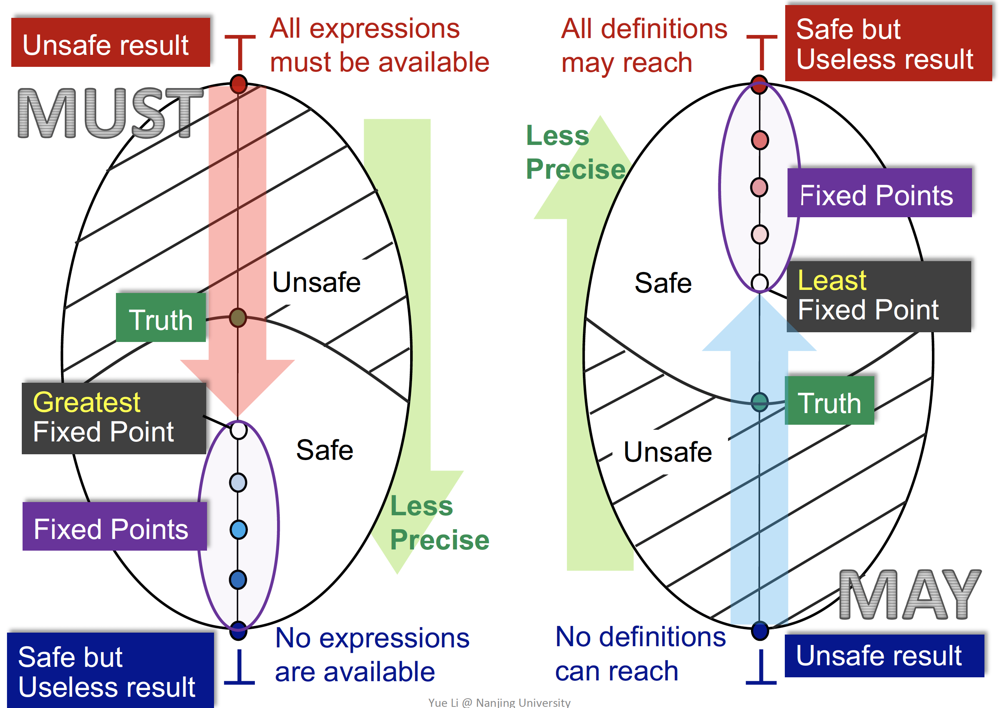

## Lecture 7

|                | Static call                      | Special call                      | Virtual call                     |
|----------------|----------------------------------|-----------------------------------|----------------------------------|
| **Instruction**| `invokestatic`                   | `invokespecial`                   | `invokeinterface` `invokevirtual` |
| **Receiver objects** | ✗                            | ✓                                 | ✓                                |
| **Target methods** | - Static methods              | - Constructors - Private instance methods - Superclass instance methods | - Other instance methods          |
| **#Target methods** | 1                            | 1                                 | ≥1 (polymorphism)                |
| **Determinacy** | Compile-time                    | Compile-time                      | Run-time                         |

- a signature acts as an identifier of a method
  - signature = class type + method name + Descriptror
  - Descriptor = return type + parameters types

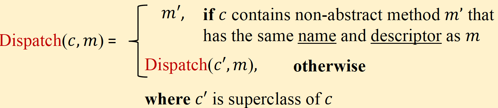
