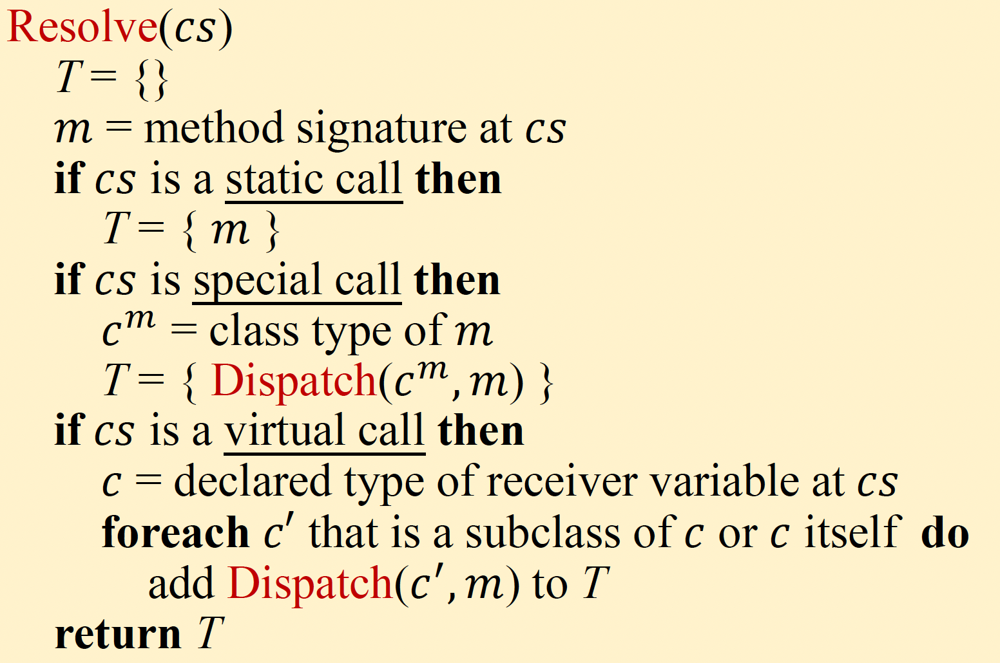
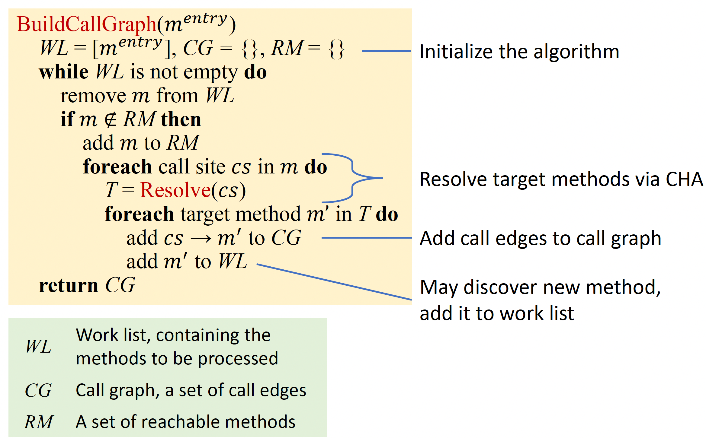
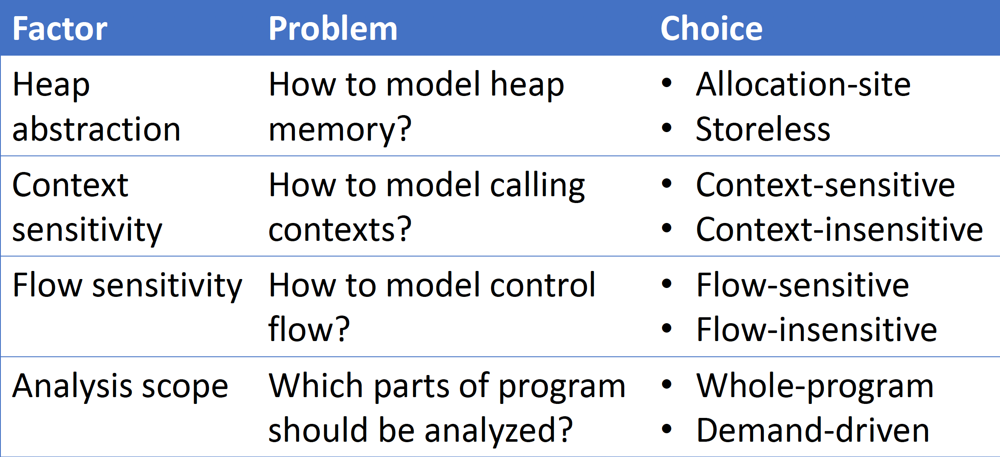
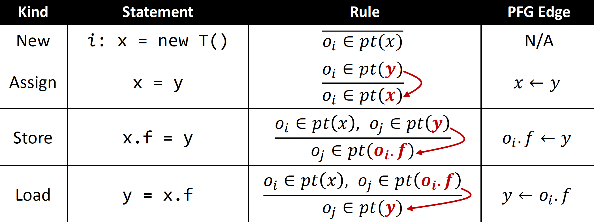
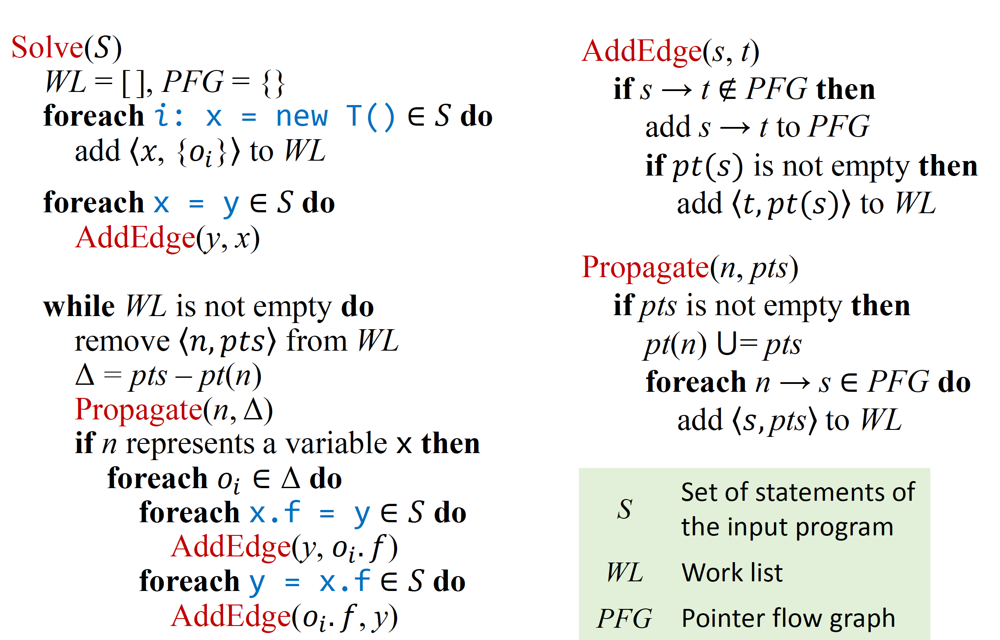
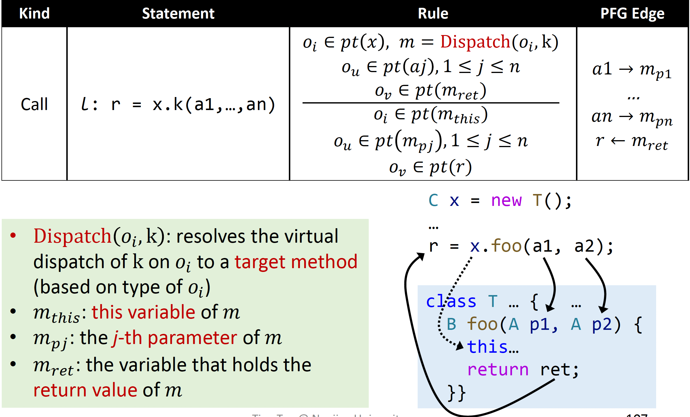
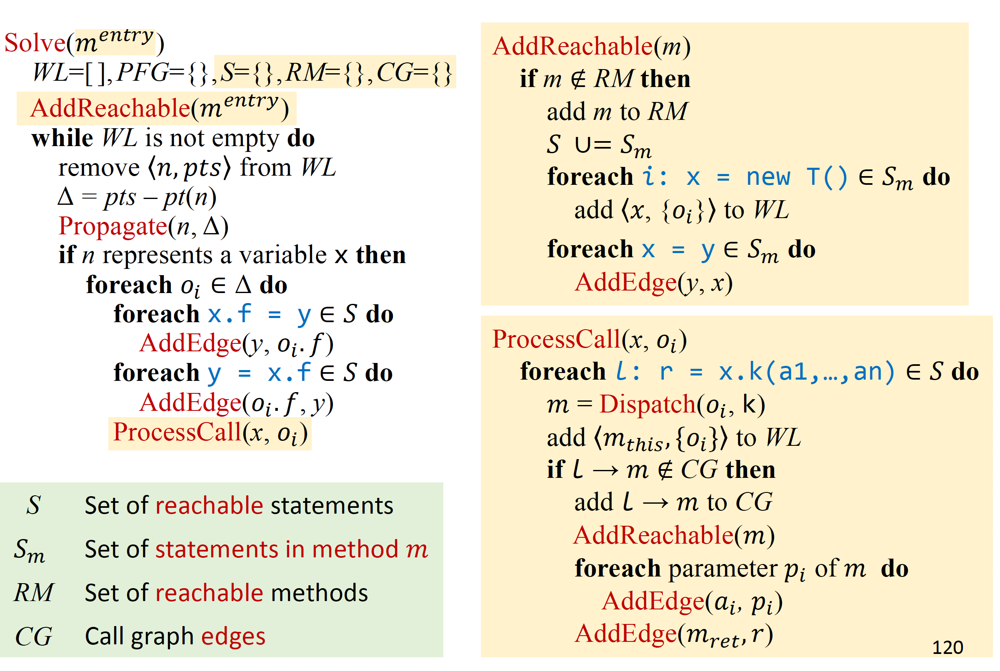

# Notes for NJU static analysis

## Lecture 1 Introduction

Static analysis analyzes a program P to reason about its behaviors and
determines whether it satisfies some properties before running P.

**Rice's Theorem:**
Any non-trivial property of the behavior of programs in a r.e. language is undecidable

> r.e. (recursively enumerable) = recognizable by a Turing-machine

A property is trivial if either it is not satisfied by any r.e. language,
or if it is satisfied by all r.e. languages; otherwise it is non-trivial.

> non-trivial properties ~= interesting properties ~= the properties related with run-time behaviors of programs


- An algorithm is sound if, anytime it returns an answer, the answer is true;
- An algorithm is complete if it guarantees to return all true answers.
- Compromise soundness (false negatives)
- Compromise completeness (false positives)

> Two Words to Conclude Static Analysis: Abstraction + Over-approximation

In static analysis, transfer functions define how to evaluate
different program statements on abstract values.

## Lecture 2 IR(IntermediateRepresentation)

AST(Abstract syntax tree)

- high-level and closed to grammar structure
- usually language dependent
- suitable for fast type checking
- lack of control flow information

IR(Intermediate Representation)

- low-level and closed to machine code
- usually language independent
- compact and uniform
- contains control flow information
- usually considered as the basis for static analysis

3 Address Code(3AC), each address can be one of the three things:

- name: a, b, c
- constant: 3
- compiler-generated temporary: t1

some common 3AC forms

- `x = y bop z` (bop -> binary operation)
- `x = up y` (up -> unary operation)
- `x = y`
- `goto L`
- `if x goto L`
- `if x rop y goto L` (rop -> relational operation)

Control Flow Analysis

- Usually refer to building Control Flow Graph (CFG)
- CFG serves as the basic structure for static analysis
- The node in CFG can be an individual 3-address instruction or (usually) a Basic Block (BB)

Basic blocks (BB) are maximal sequences of consecutive
three-address instructions with the properties that

- It can be entered only at the beginning, i.e., the first
instruction in the block
- It can be exited only at the end, i.e., the last instruction
in the block


## Lecture 3 - 4 (Dataflow Analysis Application)

Input and Output States

- Each execution of an IR statement transforms an input state to a new output state
- The input (output) state is associated with the program point before (after) the statement

Data-flow analysis is to find a solution to a set of safe-approximation directed constraints on the IN[s]’s and OUT[s]’s for all statements s.

- constraints based on semantics of statements (transfer functions)
- constraints based on the flows of control


Notations for control flow's constraints


### Reaching Definitions

A definition d at program point `p` reaches a point `q` if there is a path from `p` to `q` such that d is not “killed” along that path

- A definition of a variable `v` is a statement that assigns a value to `v`
- Translated as: definition of variable `v` at program point p reaches point `q` if there is a path from `p` to `q` such that no new definition of `v` appears on that path
- Reaching definitions can be used to detect possible undefined
variables. e.g., introduce a dummy definition for each variable `v` at the entry of CFG, and if the dummy definition of `v` reaches a point `p` where `v` is used, then `v` may be used before definition (as undefined reaches `v`)

$$ D: v = x \, op \,y$$
This statement “generates” a definition `D` of variable `v` and “kills” all the other definitions in the program that define variable `v`, while leaving the remaining incoming definitions unaffected


When more facts flow in IN[S], the “more facts” either is killed, or flows to OUT[S] (survivorS). When a fact is added to OUT[S], through either genS, or survivorS , it stays there forever. Thus OUT[S] never shrinks (e.g., 0à1, or 1à1). As the set of facts is finite (e.g., all definitions in the program), there must exist a pass of iteration during which nothing is added to any OUT, and then the algorithm terminates

### Live Variables Analysis

Live variables analysis tells whether the value of variable v at program point p could be used along some path in CFG starting at p. If so, v is live at p; otherwise, v is dead at p. Information of live variables can be used for register allocations. e.g., at some point all registers are full and we need to use one, then we should favor using a register with a dead value.


### Available Expressions Analysis

An expression x op y is available at program point p if (1) all paths from the entry to p must pass through the evaluation of x op y, and (2) after the last evaluation of x op y, there is no redefinition of x or y

- This definition means at program p, we can replace expression
x op y by the result of its last evaluation
- The information of available expressions can be used for
detecting global common subexpressions.


### Analysis Comparison


## Lecture 5 - 6 (Dataflow Analysis Foundation)


## Lecture 7 Interprocedural Analysis

Call Graph

- A representation of calling relationships in the program
- Essentially, a call graph is a set of call edges from call-sites to their target methods (callees)

|                | Static call                      | Special call                      | Virtual call                     |
|----------------|----------------------------------|-----------------------------------|----------------------------------|
| **Instruction**| `invokestatic`                   | `invokespecial`                   | `invokeinterface`<br>`invokevirtual` |
| **Receiver objects** | ✗                            | ✓                                 | ✓                                |
| **Target methods** | - Static methods              | - Constructors<br>- Private instance methods<br>- Superclass instance methods | - Other instance methods          |
| **#Target methods** | 1                            | 1                                 | ≥1 (polymorphism)                |
| **Determinacy** | Compile-time                    | Compile-time                      | Run-time                         |

- a signature acts as an identifier of a method
  - signature = class type + method name + Descriptror
  - Descriptor = return type + parameters types


### Class Hierarchy Analysis (CHA)

- Require the class hierarchy information (inheritance structure) of the whole program
- Resolve a virtual call based on the declared type of receiver variable of the call site

  ```java
  A a = ...
  a.foo();
  ```

- Assume the receiver variable amay point to objects of class Aor all subclasses of A
  - Resolve target methods by looking up the class hierarchyof class A



Features of CHA
Advantage: fast

- Only consider the declared type of receiver variable at the call-site, and its inheritance hierarchy
- Ignore data-and control-flow information

Disadvantage: imprecise

- Easily introduce spurious target methods
- Addressed in next lectures

Call Graph Construction
Build call graph for whole program via CHA

- Start from entry methods (focus on main method)
- For each reachable method `m`, resolve target methods for each call site `cs` in `m` via CHA (`Resolve(cs)`)
- Repeat until no new method is discovered



### Interprocedural Control-Flow Graph

- CFG represents structure of an individual method
- ICFG represents structure of the whole program
  - With ICFG, we can perform interproceduralanalysis
- An ICFG of a program consists of CFGs of the methods in the program, plus two kinds of additional edges:
  - Call edges: from call sites to the entry nodes of their callees
  - Return edges: from exit nodes of the callees to the statementsfollowing their call sites (i.e., return sites)
  
  The information for connecting these two kinds of edges comes from call graph.

$$ICFG = CFGs + call \, \& \, return \, edges$$

> Edges from call sites to return site are call-to-return edges

### Interprocedural Analysis

|                         | **Intraprocedural**                          | **Interprocedural**                                       |
|-------------------------|----------------------------------------------|-----------------------------------------------------------|
| **Program representation** | CFG                                          | ICFG = CFGs + call & return edges                          |
| **Transfer functions**     | Node transfer                                | Node transfer + edge transfer                              |

Edge transfer

- Call edge transfer: transfer data flow from call site to the
entry node of callee (along call edges),  it pass argument values
- Return edge transfer: transfer data flow from exit node of
the callee to the return site (along return edges), it pass return values
- Node transfer: same as intraprocedural constant propagation, except that: **For call nodes, the transfer function is identity function**
- Call to Return Edge allows the analysis to propagate local data-flow(`a=6` in this case) on ICFG.
  - Without such edges, we have to propagate local data-flow across other methods, which is very inefficient.
  - kill the value of the LHS variable of the call site. Its value will flow to return site along the return edges.Otherwise, it may cause imprecision.

## Lecture 8 Pointer Analysis

Two closely related but different concepts

- Pointer analysis: which objects a pointer can point to?
- Alias analysis: can two pointers point to the same object?

Key Factors in Pointer Analysis:

- Pointer analysis is a complex system
- Multiple factors affect the precision and efficiency of the system



### Heap Abstraction

we choose the most-common used heap abstraction, Allocation Site Abstraction

- Model concrete objects by their allocation sites
- One abstract object per allocation site to represent all its allocated concrete objects
- The number of allocation sites in a program is bounded,
thus the abstract objects must be finite.

### Context Sentivity

Context-sensitive:

1. Distinguish different calling contexts of a method
2. Analyze each method multiple times, once for each context

Context-insensitive

1. Mergeall calling contexts of a method
2. Analyze each method once

### Flow Sensitivity

Flow-sensitive

- Respect the execution order of the statements
- Maintain a map of points-to relations at each program location

Flow-insensitive

- Ignore the control-flow order, treat the program as a set of unordered statements
- Maintain one map of points-to relations for the whole program

### Analysis Scope

Whole-program

- Compute points-to information for all pointersin the program
- Provide information for all possible clients

Demand-driven

- Only compute points-to information for the pointers that may affect specific sites of interest (on demand)
- Provide information for specific clients

## Lecture 9-10 Pointer Analysis Foundation

Pointer Flow Rules:



With PFG, pointer analysis can be solved by computing transitive closureof the PFG



WorkList:

- Worklist contains the points-to information to be processed
- Each worklist entry 𝑛,𝑝 is a pair of pointer n and points-to set pts, which means that pts should be propagated to pt(n)

Differential Propagation

- Differential propagation is employed to avoid propagation and processing of redundant points-to information
- Insight: existing points-to information in `p(n)` have already been propagated to `n`’s successors, and no needto be propagated again




